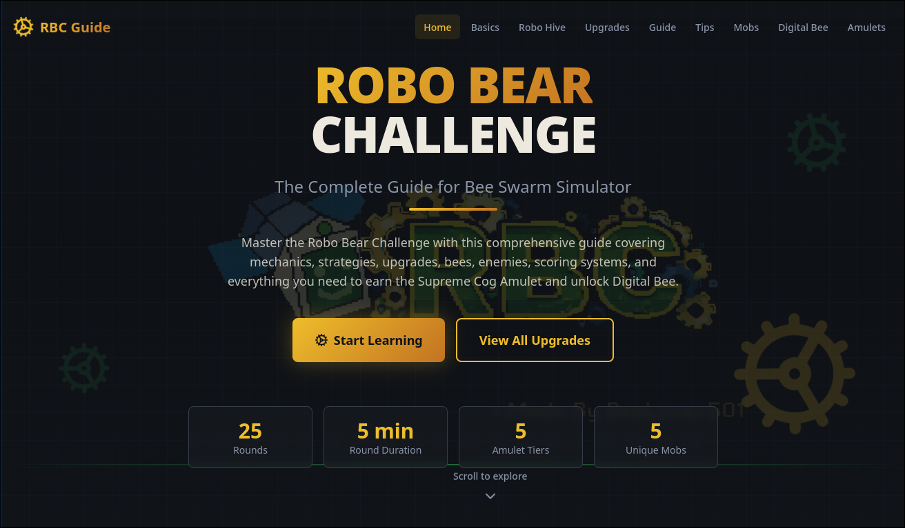

# 🤖 ROBO BEAR CHALLENGE GUIDE

> The Complete Interactive Guide for Mastering the Robo Bear Challenge in Bee Swarm Simulator

[](https://opensource.org/licenses/MIT)
[](https://react.dev/)
[](https://vitejs.dev/)
[](https://www.typescriptlang.org/)
[](#-platform-support)

## Overview

**ROBO BEAR CHALLENGE GUIDE** is a comprehensive, interactive educational web application designed to help players master the Robo Bear Challenge in **Bee Swarm Simulator** (Roblox). This guide covers everything you need to succeed: game mechanics, strategies, optimal upgrade paths, bee selections, enemy patterns, scoring systems, and the coveted Supreme Cog Amulet.

The application is built with modern web technologies, featuring a responsive design, smooth animations, and organized sections for easy navigation.



## ✨ Features

- 📚 **Comprehensive Sections**
  - Basics & Game Mechanics
  - Robo Hive Setup & Strategy
  - Optimal Upgrades Guide
  - Complete Guide & Tips
  - Mob Patterns & Weaknesses
  - Digital Bee Abilities
  - Supreme Cog Amulet Farming

- 🎨 **Modern UI/UX**
  - Responsive design for all devices
  - Dark theme optimized for gaming
  - Smooth animations and transitions
  - Interactive accordions and cards
  - Fast load times with Vite

- 🛠️ **Developer-Friendly**
  - Built with React + TypeScript
  - Tailwind CSS for styling
  - shadcn/ui component library
  - Cross-platform compatibility
  - Easy to extend and customize

## 🚀 Quick Start

### Prerequisites

- **Node.js** 16+ ([Download](https://nodejs.org/))
- **Go** 1.16+ ([Download](https://golang.org/dl/)) - *for development scripts*
- **npm** (comes with Node.js)

### Installation

#### Windows

```bash
# Clone the repository
git clone https://github.com/yourusername/robo-guide.git
cd ROBO_GUIDE

# Install dependencies
npm install

# Start development server
cd tools\runLOCAL
RUN_LOCAL.bat
```

If you prefer using npm directly:
```bash
npm run dev
```

The application will open in your default browser at `http://localhost:8080`

#### Linux / macOS

```bash
# Clone the repository
git clone https://github.com/yourusername/robo-guide.git
cd ROBO_GUIDE

# Install dependencies
npm install

# Make scripts executable
chmod +x tools/runLOCAL/RUN_LOCAL.sh
chmod +x tools/serve/RUN_NGROK.sh

# Start development server
make dev
```

Or run npm directly:
```bash
npm run dev
```

The application will open in your default browser at `http://localhost:8080`

## 📖 Usage

### Using Make (Linux/macOS)

```bash
# View all available commands
make help

# Run development server
make dev

# Run with ngrok tunnel (for external access)
make serve

# Build for production
make build

# Run linter
make lint

# Clean build artifacts
make clean
```

### Using npm Directly

```bash
# Development
npm run dev

# Production build
npm run build

# Preview production build
npm preview

# Lint code
npm run lint
```

### Using Development Scripts

**Windows:**
```bash
# Local development
cd tools\runLOCAL
RUN_LOCAL.bat

# With ngrok tunnel
cd tools\serve
RUN_NGROK.bat
```

**Linux/macOS:**
```bash
# Local development
./tools/runLOCAL/RUN_LOCAL.sh

# With ngrok tunnel
./tools/serve/RUN_NGROK.sh
```

## 📁 Project Structure

```
ROBO_GUIDE/
├── src/
│   ├── components/
│   │   ├── Navbar.tsx                 # Navigation component
│   │   ├── HeroSection.tsx            # Landing section
│   │   ├── BasicsSection.tsx          # Game mechanics
│   │   ├── RoboHiveSection.tsx        # Hive setup guide
│   │   ├── UpgradesSection.tsx        # Upgrade strategies
│   │   ├── GuideSection.tsx           # Complete guide
│   │   ├── TipsSection.tsx            # Pro tips
│   │   ├── MobsSection.tsx            # Mob patterns
│   │   ├── DigitalBeeSection.tsx      # Digital Bee guide
│   │   ├── AmuletsSection.tsx         # Amulet farming
│   │   ├── Footer.tsx                 # Footer
│   │   └── ui/                        # shadcn/ui components
│   ├── hooks/
│   │   ├── use-mobile.tsx             # Mobile detection
│   │   └── use-toast.ts               # Toast notifications
│   ├── lib/
│   │   └── utils.ts                   # Utility functions
│   ├── assets/                        # Images and media
│   ├── App.tsx                        # App component
│   ├── index.css                      # Global styles
│   └── main.tsx                       # Entry point
├── tools/
│   ├── runLOCAL/
│   │   ├── RUN_LOCAL.go               # Local dev server (Go)
│   │   └── RUN_LOCAL.bat              # Windows batch script
│   │   └── RUN_LOCAL.sh               # Linux/macOS shell script
│   ├── serve/
│   │   ├── RUN_NGROK.go               # Ngrok tunnel (Go)
│   │   └── RUN_NGROK.bat              # Windows batch script
│   │   └── RUN_NGROK.sh               # Linux/macOS shell script
│   └── README.md                      # Tools documentation
├── package.json                       # Dependencies
├── vite.config.ts                     # Vite configuration
├── tailwind.config.ts                 # Tailwind CSS config
├── tsconfig.json                      # TypeScript config
├── Makefile                           # Make commands
└── README.md                          # This file
```

## 🛠️ Development

### Tech Stack

- **Frontend Framework**: React 18
- **Language**: TypeScript
- **Build Tool**: Vite 5
- **Styling**: Tailwind CSS 3
- **Components**: shadcn/ui
- **Form Handling**: React Hook Form
- **Notifications**: Sonner
- **Icons**: Lucide React

### Building for Production

```bash
# Build optimized production bundle
npm run build

# Preview production build locally
npm run preview
```

The production build will be output to the `dist/` directory.

### Code Quality

```bash
# Run ESLint
npm run lint

# Format code (optional, requires prettier)
npx prettier --write src/
```

## 🌐 Platform Support

| Platform | Support | Installation |
|----------|---------|--------------|
| **Windows** 10+ | ✅ Full | See [Windows Installation](#windows) |
| **Linux** (Ubuntu, Fedora, etc.) | ✅ Full | See [Linux Installation](#linux--macos) |
| **macOS** 10.12+ | ✅ Full | See [Linux / macOS](#linux--macos) |
| **Web Browsers** | ✅ Modern Browsers | Chrome, Firefox, Safari, Edge |

### Browser Support

- Chrome/Chromium 90+
- Firefox 88+
- Safari 14+
- Edge 90+

## 📝 License

This project is licensed under the MIT License - see the [LICENSE](LICENSE) file for details.

## 🤝 Contributing

Contributions are welcome! Whether it's fixing bugs, adding new sections, improving documentation, or suggesting features, your help is appreciated.

### How to Contribute

1. Fork the repository
2. Create a feature branch (`git checkout -b feature/amazing-feature`)
3. Make your changes
4. Commit your changes (`git commit -m 'Add amazing feature'`)
5. Push to the branch (`git push origin feature/amazing-feature`)
6. Open a Pull Request

### Contribution Ideas

- Add new strategy sections
- Improve animations and UX
- Fix bugs or typos
- Add more interactive elements
- Optimize performance
- Improve documentation
- Suggest new features

## 👨‍💻 Original Author

**BeeLover501**

Reach out to BeeLover501 if you're interested in contributing to this project!

## 💬 Support & Feedback

If you encounter any issues or have suggestions for improvements:

1. Check existing [Issues](https://github.com/yourusername/robo-guide/issues)
2. Create a new issue with detailed information
3. Provide feedback and suggestions

## 🔗 Resources

- [Bee Swarm Simulator Wiki](https://bee-swarm-simulator.fandom.com/)
- [React Documentation](https://react.dev/)
- [Vite Documentation](https://vitejs.dev/)
- [Tailwind CSS Documentation](https://tailwindcss.com/)
- [TypeScript Documentation](https://www.typescriptlang.org/)

## 📊 Project Stats

- **Language**: TypeScript
- **Framework**: React 18
- **Build Tool**: Vite 5
- **Styling**: Tailwind CSS
- **Components**: 15+
- **Responsive**: Yes
- **Accessibility**: WCAG compliant

## 🎮 About Bee Swarm Simulator

Bee Swarm Simulator is a popular Roblox game where players manage a bee colony, collect honey, and complete challenges. The Robo Bear Challenge is one of the most demanding endgame content, requiring strategy, planning, and optimization.

This guide exists to help players master this challenging content and earn the prestigious Supreme Cog Amulet!

---

**Last Updated**: May 30, 2026

**Made with ❤️ for the Bee Swarm Simulator Community**
